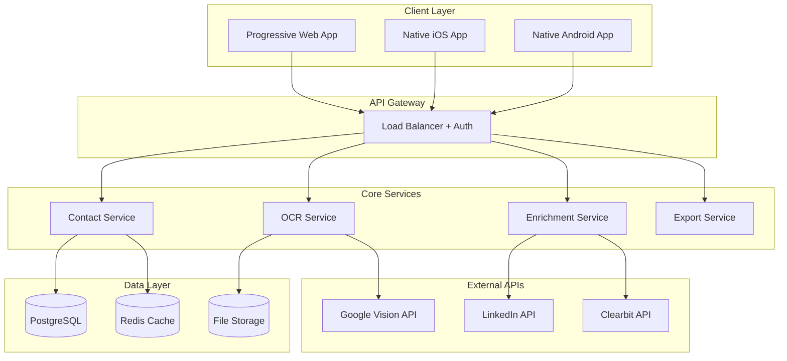

# 2. System Overview

## 2.1 High-Level Architecture

## 2.2 Core Components

### Frontend Applications
- **Progressive Web App (Phase 0-1):** React + TypeScript for rapid prototyping
- **Native Mobile Apps (Phase 2+):** iOS (Swift/React Native) + Android for production

### Backend Services
- **API Gateway:** Authentication, rate limiting, request routing
- **OCR Service:** Image processing and text extraction
- **Enrichment Service:** Company and LinkedIn data enhancement
- **Contact Service:** Contact storage, search, and management
- **Export Service:** Data export and synchronization

### Data Storage
- **PostgreSQL:** Primary contact and user data storage
- **Redis:** Caching layer for performance
- **S3/Cloud Storage:** Image and file storage
