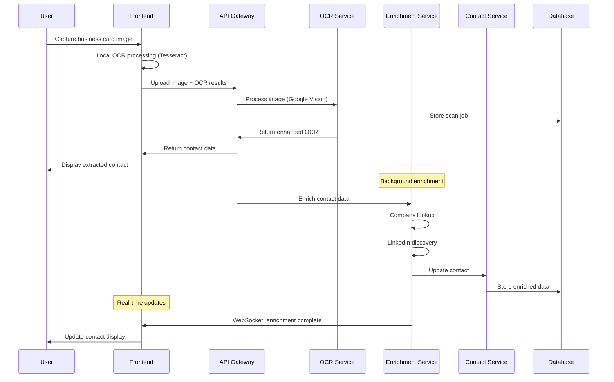
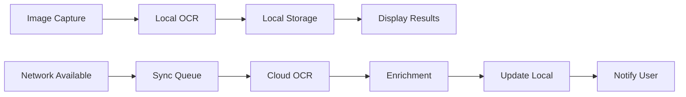

# 4. Data Architecture

## 4.1 Database Schema

### Core Tables
```sql
-- Users table
CREATE TABLE users (
    id UUID PRIMARY KEY DEFAULT gen_random_uuid(),
    email VARCHAR(255) UNIQUE NOT NULL,
    created_at TIMESTAMP DEFAULT CURRENT_TIMESTAMP,
    updated_at TIMESTAMP DEFAULT CURRENT_TIMESTAMP,
    settings JSONB DEFAULT '{}'
);

-- Contacts table
CREATE TABLE contacts (
    id UUID PRIMARY KEY DEFAULT gen_random_uuid(),
    user_id UUID REFERENCES users(id) ON DELETE CASCADE,
    
    -- Basic contact info
    first_name VARCHAR(100),
    last_name VARCHAR(100),
    full_name VARCHAR(200),
    title VARCHAR(200),
    company VARCHAR(200),
    email VARCHAR(255),
    phone VARCHAR(50),
    
    -- Enriched data
    company_info JSONB DEFAULT '{}',
    linkedin_profile JSONB DEFAULT '{}',
    social_profiles JSONB DEFAULT '[]',
    
    -- Metadata
    source VARCHAR(50) DEFAULT 'scan',
    tags TEXT[],
    notes TEXT,
    last_contact_date TIMESTAMP,
    relationship_score INTEGER DEFAULT 0,
    
    -- Audit fields
    created_at TIMESTAMP DEFAULT CURRENT_TIMESTAMP,
    updated_at TIMESTAMP DEFAULT CURRENT_TIMESTAMP,
    
    -- Search optimization
    search_vector tsvector
);

-- Scan jobs table
CREATE TABLE scan_jobs (
    id UUID PRIMARY KEY DEFAULT gen_random_uuid(),
    user_id UUID REFERENCES users(id) ON DELETE CASCADE,
    
    -- Job metadata
    status VARCHAR(50) DEFAULT 'processing',
    image_url TEXT,
    
    -- Processing results
    ocr_results JSONB DEFAULT '{}',
    enrichment_status JSONB DEFAULT '{}',
    
    -- Relationships
    contact_id UUID REFERENCES contacts(id),
    
    -- Audit
    created_at TIMESTAMP DEFAULT CURRENT_TIMESTAMP,
    completed_at TIMESTAMP
);

-- Indexes for performance
CREATE INDEX idx_contacts_user_id ON contacts(user_id);
CREATE INDEX idx_contacts_search ON contacts USING gin(search_vector);
CREATE INDEX idx_contacts_company ON contacts(company);
CREATE INDEX idx_contacts_created_at ON contacts(created_at DESC);
CREATE INDEX idx_scan_jobs_status ON scan_jobs(status);
CREATE INDEX idx_scan_jobs_user_id ON scan_jobs(user_id);
```

## 4.2 Data Flow Architecture

### Primary Scan Workflow


### Offline Processing Flow

